# 🧠 Nexus Knowledge Portal

<p align="center">

**AI-Powered Project Knowledge & Discovery Platform**

Turn repositories, documents, reusable code, and project tasks into an intelligent, searchable knowledge base.

<br/>

[](https://react.dev/)
[](https://vite.dev/)
[](https://fastapi.tiangolo.com/)
[](https://www.postgresql.org/)
[](https://github.com/pgvector/pgvector)
[](https://redis.io/)
[](https://python-rq.org/)
[](https://ollama.com/)
[](https://www.docker.com/)

</p>

---

## 📖 Table of Contents

* [Overview](#-overview)
* [Why Nexus?](#-why-nexus)
* [Core Features](#-core-features)
* [How It Works](#-how-it-works)
* [System Architecture](#-system-architecture)
* [Knowledge Ingestion](#-knowledge-ingestion-pipeline)
* [AI Question Answering](#-ai-question-answering-pipeline)
* [GitHub Repository Intelligence](#-github-repository-intelligence)
* [Semantic Search](#-semantic-search)
* [AI Task Creation](#-ai-assisted-task-creation)
* [Technology Stack](#-technology-stack)
* [Project Structure](#-project-structure)
* [Backend Architecture](#-backend-architecture)
* [Frontend Architecture](#-frontend-architecture)
* [Database Design](#-database-design)
* [API Documentation](#-api-documentation)
* [Authentication](#-authentication)
* [Role-Based Access](#-role-based-access)
* [Docker Architecture](#-docker-architecture)
* [Environment Configuration](#-environment-configuration)
* [Installation](#-installation)
* [Running the Project](#-running-the-project)
* [Screenshots](#-screenshots)
* [Example Workflow](#-complete-example-workflow)
* [Development Guide](#-development-guide)
* [Troubleshooting](#-troubleshooting)
* [Future Improvements](#-future-improvements)
* [Contributing](#-contributing)
* [License](#-license)

---

# 🌐 Overview

**Nexus Knowledge Portal** is an internal project knowledge and discovery platform that combines:

* 📁 Project documents
* 🐙 GitHub repositories
* 🧩 Reusable code assets
* 🔎 Semantic and keyword search
* 🤖 Local AI-powered project Q&A
* 📋 Project task management
* 👥 Developer and project management
* 💬 Persistent AI chat sessions

The primary goal is simple:

> **Make project knowledge easy to discover, understand, and act upon.**

Instead of manually searching through repositories, documentation, and task boards, developers can ask Nexus questions using natural language.

For example:

```text
Where is authentication implemented?
```

```text
What is this project about?
```

```text
Show me reusable Python functions.
```

```text
What are the main entry points of this repository?
```

```text
Create a task to implement JWT authentication.
```

Nexus retrieves relevant project information and uses a local LLM to generate an understandable response.

---

# 🎯 Why Nexus?

Modern software projects contain knowledge in many different places:

```text
                Project Knowledge
                       │
        ┌──────────────┼──────────────┐
        │              │              │
        ▼              ▼              ▼
   GitHub Repo     Documents        Tasks
        │              │              │
        ▼              ▼              ▼
      Code          PDFs/MD       Project Board
```

Finding information manually becomes increasingly difficult as projects grow.

Nexus creates a unified knowledge layer:

```text
GitHub Repository ─────┐
                       │
Documents ─────────────┤
                       ▼
                 Nexus Ingestion
                       │
                       ▼
                 Knowledge Base
                       │
          ┌────────────┼────────────┐
          │            │            │
          ▼            ▼            ▼
      Semantic      Code Asset     Task
       Search        Search       Search
          │            │            │
          └────────────┼────────────┘
                       ▼
                    AI Chat
```

---

# ✨ Core Features

## 📁 Project Management

Create and manage projects containing:

* Project information
* Project members
* Documents
* Git repositories
* Reusable code assets
* Tasks
* AI conversations

---

## 📄 Document Knowledge

Upload project documentation such as:

* PDF
* DOC / DOCX
* Markdown
* TXT
* PNG
* JPG / JPEG

The ingestion worker extracts the content, detects structure, creates chunks, generates embeddings, and stores the resulting knowledge in PostgreSQL.

---

## 🐙 Git Repository Intelligence

Nexus can ingest Git repositories and analyze their contents.

The repository analyzer can:

* Clone repositories
* Detect programming languages
* Analyze project structure
* Identify entry points
* Analyze important directories
* Extract README information
* Parse Python functions
* Parse Java / Kotlin methods
* Parse JavaScript / TypeScript functions
* Identify reusable code assets
* Generate embeddings for code assets

The extracted repository information is then available to the search and AI systems.

---

## 🔎 Hybrid Search

Nexus searches across multiple types of project information:

```text
                  Search Query
                       │
             ┌─────────┴─────────┐
             ▼                   ▼
        Vector Search        Keyword Search
             │                   │
       ┌─────┴─────┐             │
       │           │             │
 Documents     Code Assets      Tasks
       │           │             │
       └───────────┴─────────────┘
                   │
                   ▼
             Combined Results
```

The current search implementation uses:

* pgvector cosine-distance search for document chunks
* pgvector cosine-distance search for reusable code assets
* PostgreSQL keyword matching for tasks
* Project membership filtering
* Role-based content filtering
* Optional document-type filtering
* Optional programming-language filtering

---

# 🤖 AI Chat

The project contains an AI chatbot that understands different types of requests.

The chatbot classifies the user's intent and then chooses the appropriate processing path.

Conceptually:

```text
                     User Message
                          │
                          ▼
                   Intent Classifier
                          │
          ┌───────────────┼────────────────┐
          │               │                │
          ▼               ▼                ▼
     Knowledge Q&A    Project Overview   Task Query
          │               │                │
          └───────────────┼────────────────┘
                          ▼
                  Context Retrieval
                          │
                          ▼
                       Mistral
                          │
                          ▼
                       Answer
```

Task creation is handled through a separate AI-assisted workflow.

---

# 🧩 How the System Works

There are two major knowledge flows.

## Flow 1 — Knowledge Ingestion

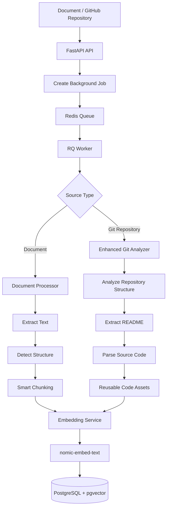

---

## Flow 2 — AI Question Answering

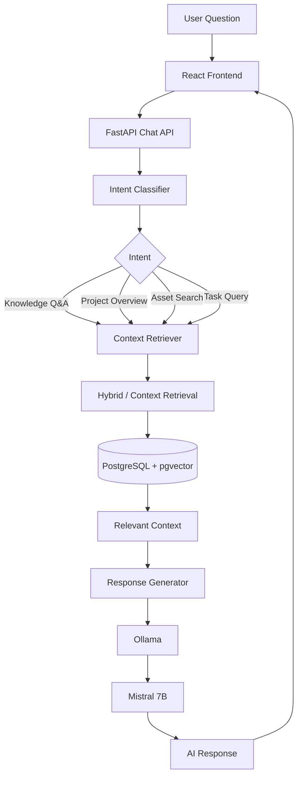

---

# 📥 Knowledge Ingestion Pipeline

## Documents

When a document is uploaded:

```text
Document
   │
   ▼
Upload API
   │
   ▼
Database Record
   │
   ▼
RQ Job
   │
   ▼
Document Processor
   │
   ├── Detect file type
   ├── Extract text
   ├── Detect headers
   ├── Detect code blocks
   └── Smart chunking
   │
   ▼
Embedding Service
   │
   ▼
nomic-embed-text
   │
   ▼
DocumentChunk
   │
   ▼
PostgreSQL + pgvector
```

### Supported extraction

| File Type    | Processing          |
| ------------ | ------------------- |
| PDF          | `pdfplumber`        |
| DOC/DOCX     | `python-docx`       |
| Markdown     | Text extraction     |
| TXT          | Text extraction     |
| PNG/JPG/JPEG | OCR using Tesseract |

---

# 🐙 GitHub Repository Intelligence

Git repositories follow a different ingestion pipeline.

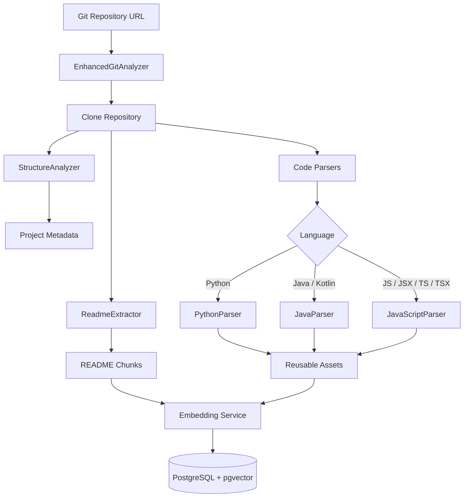

### Repository analysis includes

#### Project structure

The structure analyzer collects information such as:

* Project type
* Detected languages
* Entry points
* Key directories
* Project summary

#### README processing

README content is:

```text
README
  ↓
Sections
  ↓
Chunks
  ↓
Embeddings
  ↓
DocumentChunk
```

README chunks are stored as document chunks so they can participate in the existing retrieval pipeline.

#### Code parsing

The repository currently has dedicated parsers for:

```text
Python
Java / Kotlin
JavaScript / TypeScript
```

The parsers extract reusable code assets such as functions and methods.

An asset can contain:

```text
Asset Name
Asset Type
Language
Full Signature
Docstring
Dependencies
Example Usage
File Path
Reusability Score
Call Count
Embedding
```

---

# 🧠 Semantic Search

The embedding model used by the project is:

```text
nomic-embed-text
```

The embedding service generates vector representations for knowledge.

For example:

```text
"JWT authentication is handled by the authentication service."
                         │
                         ▼
                 Embedding Model
                         │
                         ▼
          [0.12, -0.34, 0.81, ...]
```

When the user searches:

```text
"Where is login authentication implemented?"
```

the query is also converted into an embedding.

PostgreSQL + pgvector then performs vector similarity search.

```text
Query Embedding
       │
       ▼
pgvector
       │
       ▼
Similar Knowledge
       │
       ├── Document chunks
       └── Code assets
```

---

# 💬 AI Question Answering

The chatbot stores conversation sessions in the database.

```text
ChatSession
     │
     └── ChatHistory
            ├── User message
            ├── Assistant response
            ├── Intent
            ├── Confidence
            └── Sources
```

For a normal knowledge question:

```text
User
 │
 ▼
Intent Classification
 │
 ▼
Context Retrieval
 │
 ▼
Relevant Project Knowledge
 │
 ▼
Response Generator
 │
 ▼
Mistral via Ollama
 │
 ▼
Answer
```

The response generator supplies the retrieved context and recent conversation history to the model.

---

# 📋 AI-Assisted Task Creation

One of the more advanced features is the ability to create project tasks through chat.

For example:

```text
Create a high-priority task to implement JWT authentication
and assign it to John.
```

The chatbot can generate a structured task draft.

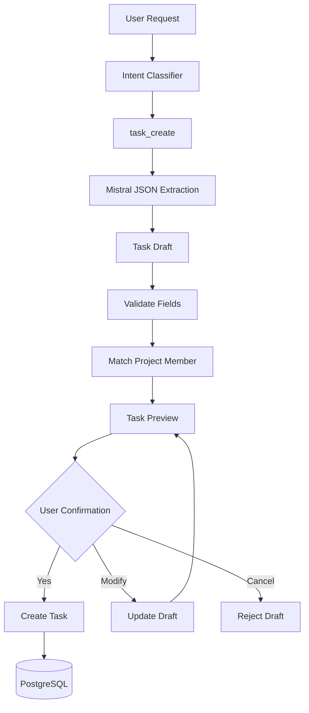

The task draft can contain:

```json
{
  "title": "Implement JWT Authentication",
  "description": "Implement JWT-based authentication...",
  "priority": "high",
  "status": "todo",
  "assignee_name": "John",
  "due_date": null,
  "time_estimate": 8
}
```

The system does **not immediately create the task**.

Instead:

```text
AI Draft
   ↓
Preview
   ↓
User Confirmation
   ↓
Create Task
```

This provides a confirmation step before modifying project data.

---

# 🏗️ System Architecture

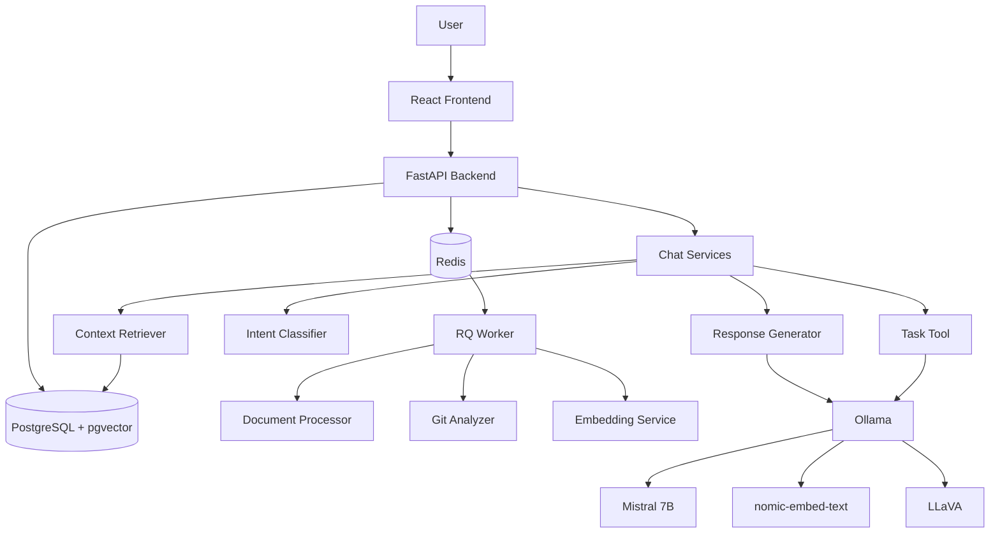

---

# 🐳 Docker Architecture

The project is containerized using Docker Compose.

Current services:

```text
postgres
redis
fastapi-backend
fastapi-worker
react-frontend
```

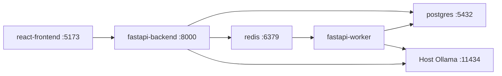

### Important

The current `docker-compose.yml` does **not** start an Ollama container.

Instead, Ollama is configured to run separately, typically on the host machine, using:

```text
OLLAMA_BASE_URL
```

The commented Ollama service in `docker-compose.yml` can be enabled if a containerized Ollama setup is desired.

---

# 🧰 Technology Stack

## Frontend

| Technology               | Purpose                   |
| ------------------------ | ------------------------- |
| React 19                 | UI                        |
| Vite                     | Development/build tooling |
| React Router             | Client-side routing       |
| Axios                    | API communication         |
| Tailwind CSS             | Styling                   |
| Lucide React             | Icons                     |
| React Markdown           | Markdown rendering        |
| React Syntax Highlighter | Code display              |
| @hello-pangea/dnd        | Drag-and-drop task board  |

## Backend

| Technology  | Purpose                     |
| ----------- | --------------------------- |
| FastAPI     | REST API                    |
| SQLAlchemy  | Database ORM                |
| Pydantic    | Request/response validation |
| PostgreSQL  | Persistent storage          |
| pgvector    | Vector similarity search    |
| Redis       | Queue                       |
| RQ          | Background jobs             |
| PyJWT / JWT | Authentication              |
| GitPython   | Repository cloning          |
| pdfplumber  | PDF extraction              |
| python-docx | DOCX extraction             |
| Tesseract   | Image OCR                   |

## AI

| Technology       | Purpose                  |
| ---------------- | ------------------------ |
| Ollama           | Local model runtime      |
| Mistral 7B       | Chat and task extraction |
| nomic-embed-text | Embeddings               |
| LLaVA            | Vision processing        |

## Infrastructure

| Technology     | Purpose                     |
| -------------- | --------------------------- |
| Docker         | Containerization            |
| Docker Compose | Multi-service orchestration |

---

# 📁 Project Structure

```text
nexus-knowledge-portal/
│
├── backend/
│   ├── app/
│   │   ├── api/
│   │   │   ├── auth.py
│   │   │   ├── chat.py
│   │   │   ├── developers.py
│   │   │   ├── documents.py
│   │   │   ├── projects.py
│   │   │   ├── search.py
│   │   │   └── tasks.py
│   │   │
│   │   ├── middleware/
│   │   │   └── auth.py
│   │   │
│   │   ├── models/
│   │   │   ├── asset.py
│   │   │   ├── base.py
│   │   │   ├── chat.py
│   │   │   ├── developer.py
│   │   │   ├── document.py
│   │   │   ├── project.py
│   │   │   └── task.py
│   │   │
│   │   ├── services/
│   │   │   ├── chat/
│   │   │   ├── ingestion/
│   │   │   └── search/
│   │   │
│   │   ├── utils/
│   │   │   ├── auth.py
│   │   │   ├── ollama_client.py
│   │   │   └── roles.py
│   │   │
│   │   ├── database.py
│   │   └── schemas.py
│   │
│   ├── migrations/
│   │   ├── init.sql
│   │   ├── 20260911_dashboard_enhancements.sql
│   │   └── 20260912_git_metadata.sql
│   │
│   ├── config.py
│   ├── Dockerfile
│   ├── main.py
│   ├── requirements.txt
│   └── worker.py
│
├── frontend/
│   ├── src/
│   │   ├── components/
│   │   ├── pages/
│   │   ├── services/
│   │   ├── App.jsx
│   │   ├── App.css
│   │   ├── index.css
│   │   └── main.jsx
│   │
│   ├── public/
│   ├── Dockerfile
│   ├── package.json
│   ├── tailwind.config.js
│   └── vite.config.js
│
├── scripts/
│   ├── init-models.sh
│   ├── reset_and_seed.py
│   └── setup_local_db.py
│
├── .env.example
├── docker-compose.yml
└── README.md
```

---

# 🔧 Backend Architecture

The backend is divided into four major layers.

```text
API
 │
 ▼
Services
 │
 ▼
Models / Database
 │
 ▼
External Infrastructure
```

---

## `backend/main.py`

Application entry point.

Responsibilities:

* Create FastAPI application
* Configure CORS
* Register authentication middleware
* Register API routers
* Ensure pgvector extension
* Create database tables
* Perform compatibility schema updates
* Expose `/health`

---

# 🌐 Backend API Layer

## `backend/app/api/`

This directory contains the REST API endpoints.

### `auth.py`

Handles authentication-related endpoints.

```text
POST /api/auth/login
GET  /api/auth/users
```

---

### `projects.py`

Handles project management.

Responsibilities include:

* Create project
* List projects
* Get project
* Update project
* Project dashboard
* Project members
* Add member
* Remove member
* Project membership validation

---

### `documents.py`

Handles knowledge assets.

Responsibilities:

* Upload documents
* Upload Git repositories
* Check processing status
* List assets
* View asset
* View asset content
* View repository tree
* Delete documents
* Delete repositories

---

### `developers.py`

Developer management.

```text
POST /api/developers
GET  /api/developers
GET  /api/developers/{dev_id}
```

---

### `tasks.py`

Project task management.

Responsibilities:

* Create task
* Update task
* List tasks
* Validate assignees
* Validate task status
* Validate priority

Supported statuses include:

```text
backlog
todo
in_progress
review
done
completed
```

Supported priorities:

```text
low
medium
high
```

---

### `search.py`

Provides project search.

```text
POST /api/projects/{project_id}/search
```

The endpoint delegates search processing to:

```text
services/search/hybrid_search.py
```

---

### `chat.py`

Provides AI chat functionality.

Responsibilities:

* Check whether project content exists
* Start chat sessions
* Process messages
* Classify intent
* Retrieve context
* Generate AI responses
* Create AI task drafts
* Confirm tasks
* Update task drafts
* Cancel task drafts
* Retrieve chat history

---

# 🧠 Backend Services

## `services/chat/`

Contains the AI chatbot logic.

### `intent_classifier.py`

Determines what the user is trying to accomplish.

The intent determines the next processing path.

Examples include:

```text
knowledge_qa
project_overview
asset_search
task_query
task_create
task_confirm
task_update
task_cancel
```

---

### `context_retriever.py`

Retrieves information needed to answer a user's question.

It connects the chatbot to the project's knowledge sources.

---

### `response_generator.py`

Builds the prompt using:

```text
System instructions
+
Retrieved context
+
Recent conversation
+
Current user question
```

and sends it to:

```text
Mistral 7B
```

through Ollama.

---

### `task_tool.py`

Contains the AI task-management workflow.

Responsibilities:

* Extract task details
* Match assignees
* Validate task fields
* Create task preview
* Update task draft
* Execute confirmed task creation

---

# 📥 Ingestion Services

Located under:

```text
backend/app/services/ingestion/
```

---

## `document_processor.py`

Responsible for:

```text
File type detection
        ↓
Text extraction
        ↓
Structure detection
        ↓
Smart chunking
```

The current chunking implementation uses approximately:

```text
800 tokens maximum
100 tokens overlap
```

with a simplified character-based token approximation.

---

## `embedding_service.py`

Responsible for generating embeddings.

Default model:

```text
nomic-embed-text
```

It also maintains a lightweight in-memory cache to avoid recomputing embeddings for identical text during the lifetime of the process.

---

## `git_analyzer.py`

The main Git repository intelligence coordinator.

It orchestrates:

```text
Clone repository
       ↓
Structure analysis
       ↓
README extraction
       ↓
Language detection
       ↓
Code parsing
       ↓
Asset extraction
```

---

## `extractors/`

### `readme_extractor.py`

Extracts:

* README content
* README sections
* Project description

### `structure_analyzer.py`

Analyzes:

* Project type
* Programming languages
* Entry points
* Important directories
* Project summary

---

## `parsers/`

Language-specific source-code parsers.

```text
python_parser.py
java_parser.py
javascript_parser.py
```

These convert source code into structured reusable assets.

---

# 🔎 Search Services

## `services/search/hybrid_search.py`

Central search implementation.

Searches three main sources:

```text
1. Document chunks
2. Reusable code assets
3. Project tasks
```

### Documents

Uses pgvector cosine distance.

### Code assets

Uses pgvector cosine distance.

### Tasks

Uses PostgreSQL `ILIKE` keyword matching.

The results are combined and sorted by relevance.

---

# 🗄️ Database Architecture

The database is PostgreSQL with the `pgvector` extension.

## Entity Relationship Diagram

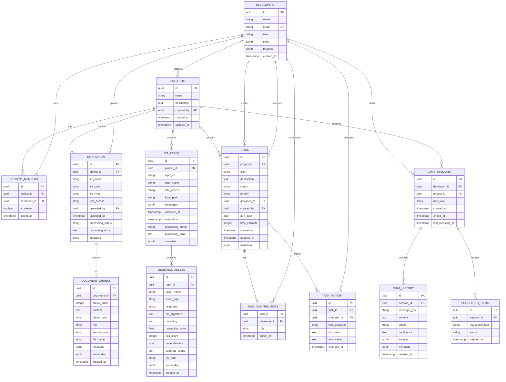

---

# 📚 Main Database Entities

| Entity              | Purpose                                 |
| ------------------- | --------------------------------------- |
| `developers`        | Project users/developers                |
| `projects`          | Projects managed by Nexus               |
| `project_members`   | Developer-project membership            |
| `documents`         | Uploaded project documents              |
| `document_chunks`   | Chunked document knowledge + embeddings |
| `git_repos`         | Linked Git repositories                 |
| `reusable_assets`   | Extracted functions/methods/code assets |
| `tasks`             | Project tasks                           |
| `task_contributors` | Additional task contributors            |
| `task_history`      | Task change history                     |
| `chat_sessions`     | AI conversation sessions                |
| `chat_history`      | User/AI messages                        |
| `suggested_tasks`   | AI-generated pending task drafts        |

---

# 🔌 API Documentation

FastAPI automatically generates interactive documentation.

After starting the backend:

**Swagger UI**

```text
http://localhost:8000/docs
```

**OpenAPI JSON**

```text
http://localhost:8000/openapi.json
```

---

## System

| Method | Endpoint  | Description      |
| ------ | --------- | ---------------- |
| `GET`  | `/health` | API health check |

---

## Authentication

| Method | Endpoint          | Description            |
| ------ | ----------------- | ---------------------- |
| `POST` | `/api/auth/login` | Authenticate developer |
| `GET`  | `/api/auth/users` | Get users              |

---

## Developers

| Method | Endpoint                   | Description      |
| ------ | -------------------------- | ---------------- |
| `POST` | `/api/developers`          | Create developer |
| `GET`  | `/api/developers`          | List developers  |
| `GET`  | `/api/developers/{dev_id}` | Get developer    |

---

## Projects

| Method   | Endpoint                                            | Description        |
| -------- | --------------------------------------------------- | ------------------ |
| `POST`   | `/api/projects`                                     | Create project     |
| `GET`    | `/api/projects`                                     | List projects      |
| `GET`    | `/api/projects/personal-dashboard`                  | Personal dashboard |
| `GET`    | `/api/projects/{project_id}`                        | Get project        |
| `PATCH`  | `/api/projects/{project_id}`                        | Update project     |
| `GET`    | `/api/projects/{project_id}/members`                | List members       |
| `POST`   | `/api/projects/{project_id}/members`                | Add member         |
| `DELETE` | `/api/projects/{project_id}/members/{developer_id}` | Remove member      |

---

## Documents & Repositories

| Method   | Endpoint                                               | Description         |
| -------- | ------------------------------------------------------ | ------------------- |
| `POST`   | `/api/projects/{project_id}/documents/upload`          | Upload document     |
| `POST`   | `/api/projects/{project_id}/repos/upload`              | Add Git repository  |
| `GET`    | `/api/projects/{project_id}/documents/{job_id}/status` | Processing status   |
| `GET`    | `/api/projects/{project_id}/assets`                    | List project assets |
| `GET`    | `/api/projects/{project_id}/assets/{asset_id}`         | Get asset           |
| `GET`    | `/api/projects/{project_id}/assets/{asset_id}/content` | Get asset content   |
| `GET`    | `/api/projects/{project_id}/assets/{asset_id}/tree`    | Get repository tree |
| `DELETE` | `/api/projects/{project_id}/documents/{document_id}`   | Delete document     |
| `DELETE` | `/api/projects/{project_id}/repos/{repo_id}`           | Delete repository   |

---

## Tasks

| Method  | Endpoint                                     | Description |
| ------- | -------------------------------------------- | ----------- |
| `POST`  | `/api/projects/{project_id}/tasks`           | Create task |
| `GET`   | `/api/projects/{project_id}/tasks`           | List tasks  |
| `PATCH` | `/api/projects/{project_id}/tasks/{task_id}` | Update task |

---

## Search

| Method | Endpoint                            | Description           |
| ------ | ----------------------------------- | --------------------- |
| `POST` | `/api/projects/{project_id}/search` | Hybrid project search |

Example request:

```json
{
  "query": "authentication",
  "page": 1,
  "page_size": 20,
  "filters": {
    "language": "python"
  }
}
```

---

## AI Chat

| Method | Endpoint                                                       | Description                   |
| ------ | -------------------------------------------------------------- | ----------------------------- |
| `GET`  | `/api/projects/{project_id}/chat/check-content`                | Check indexed project content |
| `POST` | `/api/projects/{project_id}/chat/session/start`                | Start chat session            |
| `POST` | `/api/projects/{project_id}/chat/message`                      | Send message                  |
| `GET`  | `/api/projects/{project_id}/chat/session/{session_id}/history` | Get chat history              |

---

# 🔐 Authentication

The frontend stores the authentication token in:

```text
localStorage
```

The Axios client automatically attaches:

```http
Authorization: Bearer <token>
```

to API requests.

The backend authentication middleware processes the token and places user information into the request state.

Project APIs then use:

```text
user_id
user_role
```

to enforce access.

---

# 👥 Role-Based Access

The application contains role-aware project knowledge access.

Higher-privileged roles include:

```text
manager
admin
team_lead
```

These roles can access broader project content.

Other roles are filtered against the role associated with documents or repositories.

This filtering is also applied during semantic search.

For example:

```text
User Role
    │
    ▼
Search Request
    │
    ▼
Project Membership Check
    │
    ▼
Role-Based Filtering
    │
    ▼
Vector Search
```

This prevents users from simply retrieving every indexed knowledge chunk regardless of their project role.

---

# 📦 Environment Configuration

Create a `.env` file from:

```text
.env.example
```

Important configuration categories include:

```env
ENVIRONMENT=development

DB_USER=...
DB_PASSWORD=...
DB_HOST=...
DB_PORT=...
DB_NAME=...

REDIS_HOST=...
REDIS_PORT=...
REDIS_DB=...

OLLAMA_BASE_URL=...

JWT_SECRET=...
```

When running inside Docker Compose, service names can be used for internal connectivity.

For example:

```env
DB_HOST=postgres
REDIS_HOST=redis
```

If Ollama is running on the host machine, configure `OLLAMA_BASE_URL` according to the host/container networking setup.

---

# 🚀 Installation

## Prerequisites

Install:

* Git
* Docker Desktop
* Docker Compose
* Ollama

For development outside Docker, also install:

* Python
* Node.js
* npm

---

# 1️⃣ Clone Repository

```bash
git clone https://github.com/viren1023/nexus-knowledge-portal.git

cd nexus-knowledge-portal
```

---

# 2️⃣ Configure Environment

```bash
cp .env.example .env
```

Update `.env` with your local configuration.

---

# 3️⃣ Install / Start Ollama

Install Ollama separately if it is not already installed.

Then make sure Ollama is running.

The project uses:

```text
mistral:7b
nomic-embed-text
llava
```

---

# 4️⃣ Initialize Models

Run:

```bash
bash scripts/init-models.sh
```

This initializes the models required by the application.

---

# 5️⃣ Start Docker Services

```bash
docker compose up -d --build
```

Check service status:

```bash
docker compose ps
```

Expected services:

```text
nexus-postgres
nexus-redis
nexus-backend
nexus-worker
nexus-frontend
```

---

# 🌐 Application URLs

| Service    | URL                                |
| ---------- | ---------------------------------- |
| Frontend   | http://localhost:5173              |
| Backend    | http://localhost:8000              |
| Swagger    | http://localhost:8000/docs         |
| OpenAPI    | http://localhost:8000/openapi.json |
| PostgreSQL | localhost:5433                     |
| Redis      | localhost:6379                     |
| Ollama     | localhost:11434                    |

> PostgreSQL is exposed on host port `5433` while PostgreSQL listens on `5432` inside its container.

---

# 🖥️ Screenshots

Add real screenshots from the running application here.

Recommended structure:

## Login

```text
docs/screenshots/login.png
```

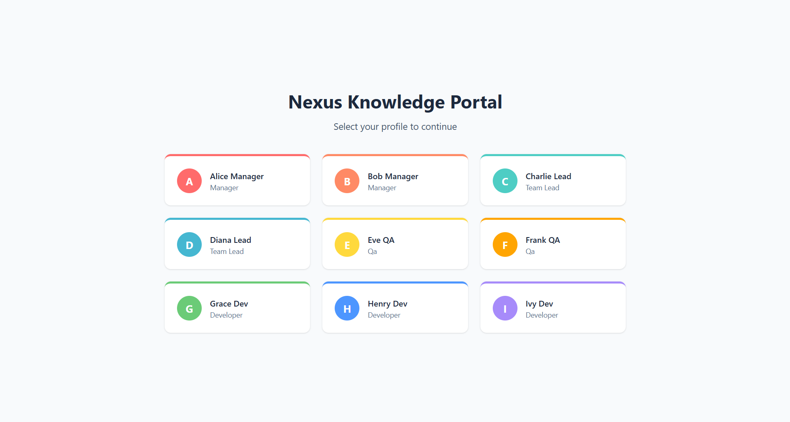

---

## Dashboard

```text
docs/screenshots/dashboard.png
```

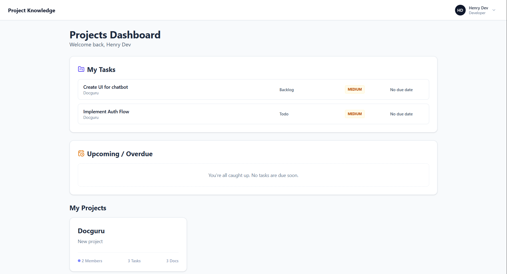

---

## Project Details

```text
docs/screenshots/project-details.png
```

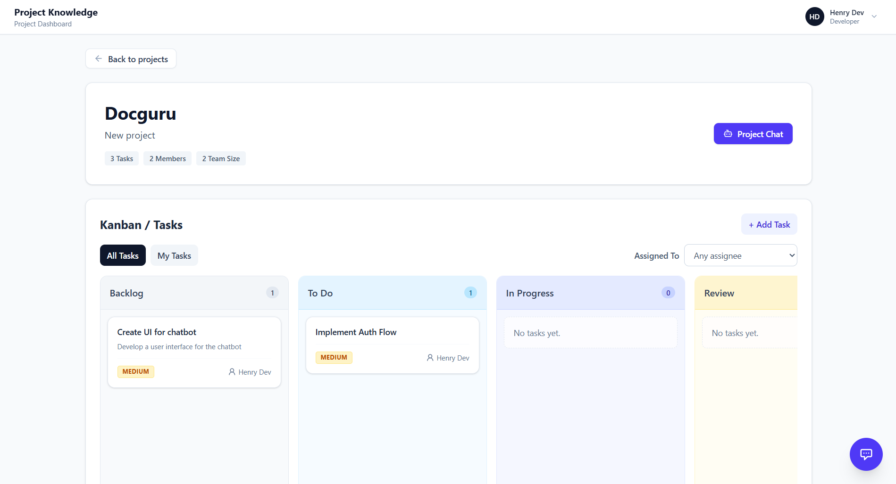

---

## Repository / Asset Explorer

```text
docs/screenshots/assets.png
```

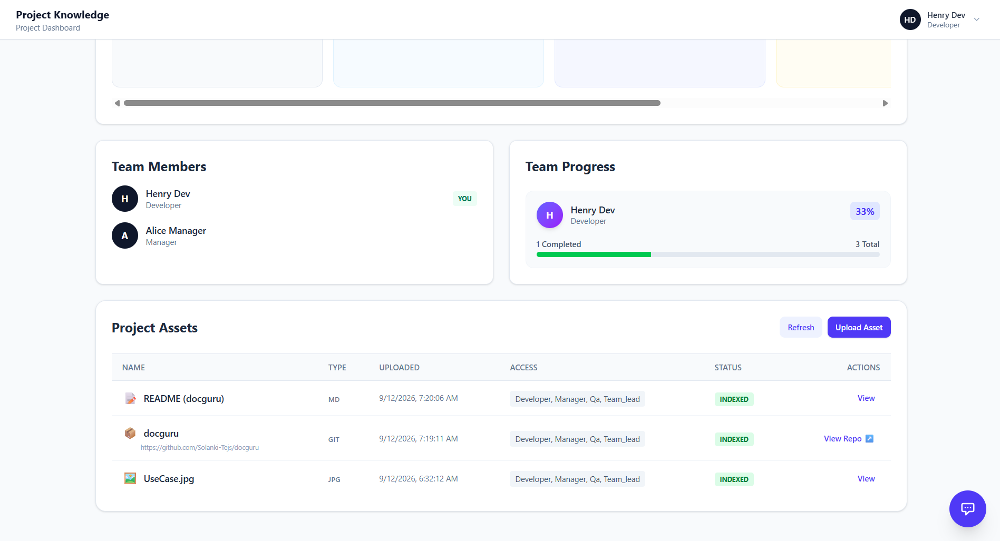

---

## AI Chat

```text
docs/screenshots/ai-chat.png
```

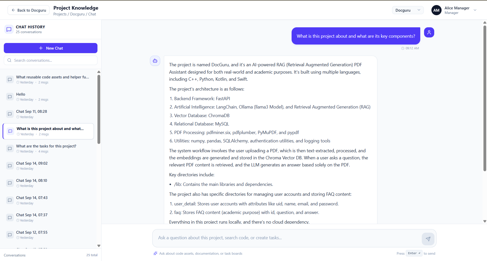

---

## Task Board

```text
docs/screenshots/task-board.png
```

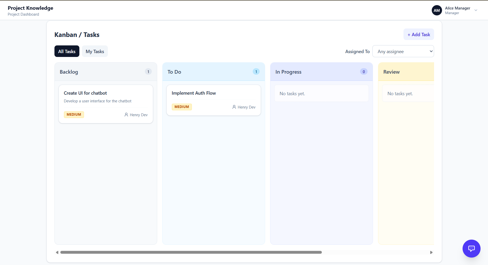

> **Tip:** Create a `docs/screenshots/` directory and add actual screenshots from the running application. This makes the README much more professional on GitHub.

---

# 🔄 Complete Example Workflow

Imagine a team has a GitHub repository:

```text
https://github.com/example/project
```

## Step 1 — Create Project

A developer creates:

```text
Project: Payment Gateway
```

---

## Step 2 — Add Team Members

Developers are added to the project.

```text
Payment Gateway
│
├── Alice - Team Lead
├── Bob   - Developer
├── Carol - Developer
└── David - QA
```

---

## Step 3 — Add Repository

The project owner provides the Git repository URL.

```text
GitHub
   ↓
FastAPI
   ↓
Redis
   ↓
RQ Worker
```

---

## Step 4 — Repository Analysis

The worker clones and analyzes the repository.

```text
Repository
    │
    ├── Structure
    ├── README
    ├── Python
    ├── JavaScript
    └── TypeScript
```

---

## Step 5 — Code Assets

Functions and methods are extracted.

Example:

```text
authenticate_user()
create_payment()
validate_transaction()
process_refund()
```

Each asset can receive an embedding.

---

## Step 6 — README Knowledge

README sections are also chunked and embedded.

```text
README
 ├── Installation
 ├── Architecture
 ├── Authentication
 ├── API
 └── Deployment
```

---

## Step 7 — User Asks Question

```text
How does authentication work?
```

---

## Step 8 — Retrieval

Nexus searches the indexed project knowledge.

Potential results:

```text
auth.py
jwt.py
README Authentication section
login service
```

---

## Step 9 — AI Generation

The retrieved context is supplied to Mistral.

```text
Question
+
Retrieved Project Context
+
Conversation History
        ↓
      Mistral
        ↓
     Answer
```

---

## Step 10 — User Creates Task

The developer can then ask:

```text
Create a task to improve JWT token validation.
```

Nexus creates a draft:

```text
Title:
Improve JWT Token Validation

Priority:
Medium

Status:
Todo

Assignee:
Unassigned
```

The user confirms:

```text
Yes, create it.
```

The task is then persisted in PostgreSQL and appears on the project task board.

---

# 🧑‍💻 Development Guide

## Backend Development

Backend source:

```text
backend/
```

Run the FastAPI application directly:

```bash
cd backend

uvicorn main:app --reload --host 0.0.0.0 --port 8000
```

---

## Worker Development

The ingestion worker listens to the:

```text
ingestion
```

RQ queue.

Run:

```bash
cd backend

python worker.py
```

or use the Docker Compose worker.

---

## Frontend Development

```bash
cd frontend

npm install
npm run dev
```

Build:

```bash
npm run build
```

Lint:

```bash
npm run lint
```

---

# 🔍 Where Should I Look When Changing Something?

| Requirement                 | Main Files                                 |
| --------------------------- | ------------------------------------------ |
| Add API endpoint            | `backend/app/api/`                         |
| Change database model       | `backend/app/models/`                      |
| Change DB connection        | `backend/app/database.py`                  |
| Change configuration        | `backend/config.py`                        |
| Change document ingestion   | `services/ingestion/document_processor.py` |
| Change embeddings           | `services/ingestion/embedding_service.py`  |
| Change Git analysis         | `services/ingestion/git_analyzer.py`       |
| Add language parser         | `services/ingestion/parsers/`              |
| Change search               | `services/search/hybrid_search.py`         |
| Change AI intent            | `services/chat/intent_classifier.py`       |
| Change context retrieval    | `services/chat/context_retriever.py`       |
| Change AI response          | `services/chat/response_generator.py`      |
| Change AI task creation     | `services/chat/task_tool.py`               |
| Change Ollama communication | `utils/ollama_client.py`                   |
| Change authentication       | `middleware/auth.py`, `utils/auth.py`      |
| Add React page              | `frontend/src/pages/`                      |
| Add React component         | `frontend/src/components/`                 |
| Change API calls            | `frontend/src/services/api.js`             |
| Change routes               | `frontend/src/App.jsx`                     |
| Change Docker setup         | `docker-compose.yml`                       |
| Initialize AI models        | `scripts/init-models.sh`                   |

---

# 🧭 Recommended Code Reading Order

If you are new to the project, **do not start by reading every file**.

Follow this order:

### 1. Understand infrastructure

```text
docker-compose.yml
```

This tells you what services exist.

### 2. Understand backend startup

```text
backend/main.py
```

This shows:

* FastAPI setup
* Middleware
* Routers
* Database initialization

### 3. Understand frontend entry

```text
frontend/src/App.jsx
```

This shows the application's routes.

### 4. Understand API communication

```text
frontend/src/services/api.js
```

This shows how React communicates with FastAPI.

### 5. Understand database models

```text
backend/app/models/
```

Read:

```text
project.py
document.py
asset.py
task.py
chat.py
developer.py
```

### 6. Understand ingestion

Read:

```text
services/ingestion/document_processor.py
services/ingestion/git_analyzer.py
services/ingestion/embedding_service.py
```

### 7. Understand search

Read:

```text
services/search/hybrid_search.py
```

### 8. Understand AI chat

Read:

```text
services/chat/intent_classifier.py
services/chat/context_retriever.py
services/chat/response_generator.py
services/chat/task_tool.py
```

### 9. Understand background jobs

Finally read:

```text
backend/worker.py
```

At this point, the complete application flow should be clear.

---

# 🔬 Important Implementation Details

## Document Embedding

Document chunks are embedded before being inserted into:

```text
document_chunks.embedding
```

The project uses a vector column backed by pgvector.

---

## Repository Asset Embedding

For reusable code assets, the embedding input is based primarily on:

```text
full_signature
+
docstring
```

This gives the semantic search system information about what a function/method does.

---

## README Embedding

Repository README sections are stored as `DocumentChunk` records.

This allows README knowledge to use the same retrieval infrastructure as uploaded documents.

---

## Project Metadata

Git repositories also store metadata including:

```text
project_type
languages
entry_points
key_directories
summary
description
readme_chunks_count
assets_count
```

This metadata can be used by project-overview functionality.

---

# ⚠️ Current Architecture Notes

A few implementation details are important for anyone maintaining the project.

### Ollama is currently external to Docker Compose

The Ollama service is commented out in the current Compose file.

The backend therefore expects Ollama to be reachable through:

```text
OLLAMA_BASE_URL
```

---

### Database schema is partly model-driven

The application uses:

```python
Base.metadata.create_all(bind=engine)
```

during startup.

The project also contains SQL migration files for compatibility and additional metadata fields.

---

### Search is currently hybrid, but not all sources use vector similarity

Current behavior:

```text
Documents     → Vector similarity
Code assets   → Vector similarity
Tasks         → Keyword matching
```

This distinction is useful when modifying or improving the search engine.

---

# 🚧 Future Improvements

Potential improvements include:

### Knowledge ingestion

* Incremental Git synchronization
* Changed-file detection
* Deleted-file detection
* Commit-aware indexing
* Branch-aware indexing
* Better code chunking
* More programming languages

### Retrieval

* Hybrid BM25 + vector retrieval
* Reranking
* Better relevance scoring
* Metadata filtering
* Query expansion
* Multi-stage retrieval

### AI

* Streaming responses
* Better source citations
* Conversation summarization
* Improved intent classification
* Multi-model support
* Configurable models
* Better hallucination prevention

### Project intelligence

* Dependency graphs
* Architecture diagrams
* Commit analysis
* Contributor analytics
* Code ownership
* Automatic project summaries

### Task management

* AI task prioritization
* Automatic task estimation
* Task dependency detection
* Sprint planning
* AI-generated subtasks

### Security

* More granular permissions
* Project-level authorization
* Repository access control
* Secret management
* Production CORS configuration
* Stronger JWT configuration

---

# 🛡️ Security Considerations

Before deploying this project to production:

* Change the default JWT secret.
* Restrict CORS origins.
* Do not commit `.env`.
* Use strong database credentials.
* Secure the Ollama endpoint.
* Add HTTPS.
* Add proper authentication policies.
* Validate uploaded files.
* Restrict repository access where necessary.
* Implement production-grade authorization.

---

# 🧪 Health Check

The backend exposes:

```http
GET /health
```

Expected response:

```json
{
  "status": "healthy"
}
```

This can be used by Docker, monitoring systems, or deployment platforms to determine whether the API is responding.

---

# 📦 Useful Docker Commands

Start:

```bash
docker compose up -d
```

Build and start:

```bash
docker compose up -d --build
```

View services:

```bash
docker compose ps
```

View backend logs:

```bash
docker compose logs -f fastapi-backend
```

View worker logs:

```bash
docker compose logs -f fastapi-worker
```

View frontend logs:

```bash
docker compose logs -f react-frontend
```

View PostgreSQL logs:

```bash
docker compose logs -f postgres
```

Stop:

```bash
docker compose down
```

Stop and remove volumes:

```bash
docker compose down -v
```

> `docker compose down -v` removes persistent Docker volumes such as the PostgreSQL and Redis data volumes. Use it carefully.

---

# 🤝 Contributing

Contributions are welcome.

## Development workflow

```text
Fork
  ↓
Create branch
  ↓
Make changes
  ↓
Run tests / lint
  ↓
Verify Docker services
  ↓
Commit
  ↓
Push
  ↓
Open Pull Request
```

Example:

```bash
git checkout -b feature/improved-search

git add .

git commit -m "feat: improve project knowledge search"

git push origin feature/improved-search
```

---

# 📄 License

Add the project's chosen license here.

For an open-source release, add a corresponding:

```text
LICENSE
```

file to the repository.

---

# 🧠 The Nexus Mental Model

If you remember only one thing about the project, remember this:

```text
                         NEXUS
                           │
        ┌──────────────────┼──────────────────┐
        │                  │                  │
        ▼                  ▼                  ▼
    Documents         Git Repositories       Tasks
        │                  │                  │
        ▼                  ▼                  │
    Text Chunks       Code Assets             │
        │                  │                  │
        ▼                  ▼                  │
    Embeddings        Embeddings              │
        │                  │                  │
        └──────────┬───────┘                  │
                   ▼                          │
             PostgreSQL                      │
              + pgvector                     │
                   │                          │
                   └────────────┬─────────────┘
                                │
                                ▼
                         Semantic Search
                                │
                                ▼
                           AI Context
                                │
                                ▼
                          Ollama / Mistral
                                │
                                ▼
                           AI Response
                                │
                                ▼
                              User
```

In short:

> **Nexus ingests project knowledge, converts it into searchable representations, retrieves the most relevant information for a user's request, and uses a local AI model to turn that information into an understandable response.**

That is the core architecture behind the platform.

---

# ⭐ Project Highlights

* 🧠 Local AI-powered project knowledge
* 🔎 Semantic vector search
* 🐙 Git repository intelligence
* 📚 Document ingestion
* 🧩 Reusable code asset discovery
* 💬 Context-aware AI conversations
* 📋 AI-assisted task creation
* 👥 Project/member management
* 🔐 Role-aware knowledge access
* ⚡ Background ingestion with Redis + RQ
* 🐘 PostgreSQL + pgvector
* 🐳 Dockerized architecture
* 🏠 Self-hosted AI infrastructure

---

# 🔗 Repository

**Nexus Knowledge Portal**

https://github.com/viren1023/nexus-knowledge-portal

---

<p align="center">

### 🧠 Discover Knowledge. Understand Projects. Build Faster.

</p>
